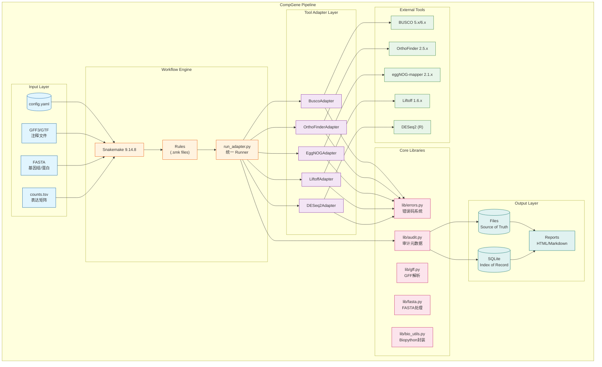
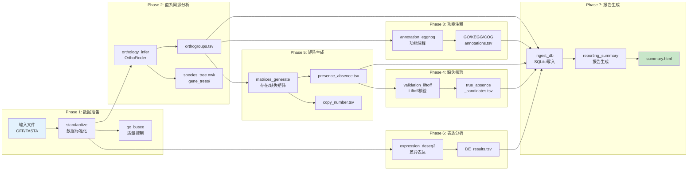
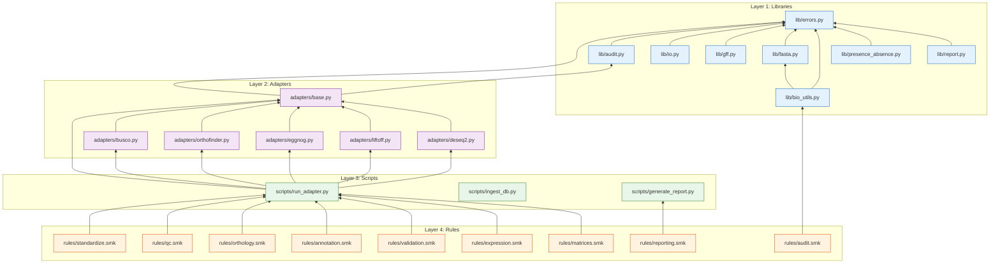
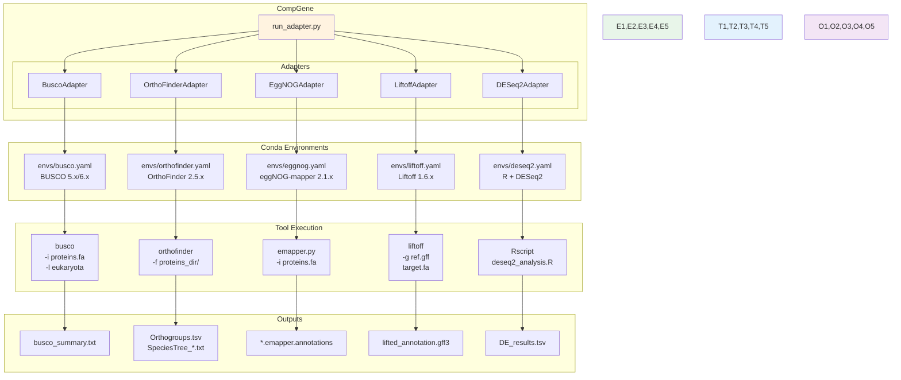
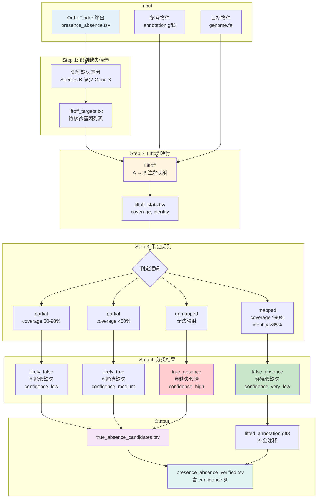
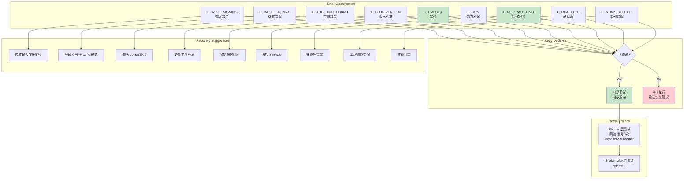
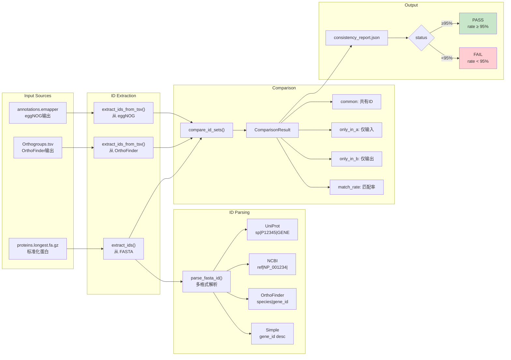
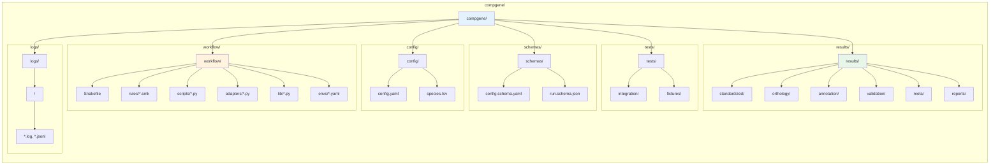

# CompGene Architecture Diagrams

本文档包含 CompGene 项目的 Mermaid 架构图。

## 1. 系统总览

## 2. 数据流图 (Pipeline DAG)

## 3. 模块依赖图

## 4. 外部工具集成

## 5. Epic 5: Liftoff 缺失核验工作流

## 6. 数据存储架构

```mermaid
flowchart TB
    subgraph "Source of Truth (Files)"
        subgraph "standardized/{species}/"
            GENOME["genome.fa.gz"]
            ANNOT["annotation.gff3.gz"]
            PROTEIN["proteins.longest.fa.gz"]
            SUMMARY["*.summary.json"]
        end

        subgraph "orthology/{species_set}/"
            OG_TSV["orthogroups.tsv"]
            TREE["species_tree.nwk"]
            GENE_TREES["gene_trees/"]
        end

        subgraph "annotation/eggnog/{species}/"
            EGG_OUT["annotations.tsv"]
        end

        subgraph "validation/liftoff/"
            LIFTED["lifted_annotation.gff3"]
            TRUE_ABS["true_absence_candidates.tsv"]
        end

        subgraph "meta/{rule}/"
            RUN_JSON["*.run.json<br/>审计记录"]
        end
    end

    subgraph "Index of Record (SQLite)"
        DB[("compgene.db")]

        T_SPECIES["species"]
        T_GENE["gene"]
        T_TRANSCRIPT["transcript"]
        T_PROTEIN["protein"]
        T_OG["orthogroup"]
        T_OG_MEMBER["orthogroup_member"]
        T_QC["qc_busco"]
        T_RUN["run"]
        T_ARTIFACT["artifact"]
        T_VERSION["tool_version"]
    end

    subgraph "Reports"
        MD["summary.md"]
        HTML["summary.html"]
    end

    GENOME --> DB
    ANNOT --> DB
    PROTEIN --> DB
    OG_TSV --> DB
    EGG_OUT --> DB
    TRUE_ABS --> DB
    RUN_JSON --> DB

    DB --> T_SPECIES
    DB --> T_GENE
    DB --> T_TRANSCRIPT
    DB --> T_PROTEIN
    DB --> T_OG
    DB --> T_OG_MEMBER
    DB --> T_QC
    DB --> T_RUN
    DB --> T_ARTIFACT
    DB --> T_VERSION

    DB --> MD
    DB --> HTML

    style DB fill:#fff3e0,stroke:#e65100
    style HTML fill:#c8e6c9
```

## 7. 错误处理与重试策略

## 8. ID 一致性检查流程 (Story 2.2b)

## 9. 项目目录结构

---

_Generated: 2026-01-29_
_Source: architecture.md_
